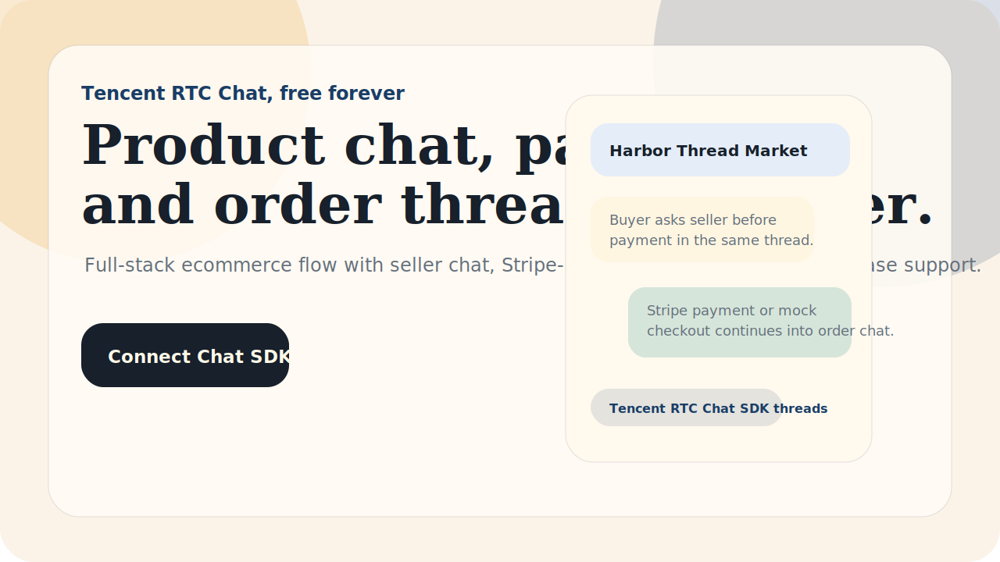

# Creator Community Chat

Build a full-stack creator community app with sign-up, channels, direct messages, moderation, and optional paid membership.

This is a full-stack Next.js starter built on **Tencent RTC Chat SDK** for teams building creator or fan communities that need real member identity, persistent channel history, unread state, creator-member DMs, moderator workflows, and premium room access.

Built for **Tencent RTC Chat, free forever**. Start here: [trtc.io/free-chat-api](https://trtc.io/free-chat-api), then use the [TRTC Console](https://console.trtc.io) to get your `SDKAppID`.



## Why Use This

Most social chat demos stop at a generic room list. Real community products need more:

- sign-up and persistent member identity
- public channels and creator announcements
- direct messages between creators and members
- moderator workflows for reports and gated access
- optional paid membership without breaking the thread
- Tencent RTC Chat SDK as the durable messaging layer underneath all of it

This repo is designed to feel like a real product, not a blank chat window.

## What Tencent RTC Chat SDK Does Here

The creator platform decides who can join and which tier is unlocked. **Tencent RTC Chat SDK owns the conversation layer.**

In this project, Tencent RTC Chat SDK is the messaging foundation for:

- community channels
- creator-member direct messages
- persistent thread history
- unread state and revisit flow
- premium room continuity after membership upgrade
- secure production login through backend-issued `UserSig`

A simple community website can work without a chat SDK. You need Tencent RTC Chat SDK when the product becomes a real-time social app with roles, rooms, threads, and follow-up.

## Demo Scenario

A new member joins a creator community called `Midnight Radio Club`.

1. The member signs in and completes profile onboarding.
2. The member joins public channels and sees creator announcements.
3. The member opens a DM thread with the creator team.
4. A premium backstage room stays locked until membership is upgraded.
5. After upgrade, the same community identity and thread history continue inside the premium room.
6. A moderator reviews flagged posts without leaving the community workspace.

## Quick Start

```bash
npm install
npm run dev
```

Open `http://localhost:3000`.

The default mode is mock mode, so the app runs without Tencent RTC Chat SDK credentials and without an AI API key.

## Connect Tencent RTC Chat SDK

1. Start from [Tencent RTC Chat, free forever](https://trtc.io/free-chat-api).
2. Open the [TRTC Console](https://console.trtc.io).
3. Create or select a Tencent RTC Chat application.
4. Copy your `SDKAppID`.
5. Keep your `SDKSecretKey` on the server only.
6. Copy `.env.example` to `.env.local`.
7. Fill in:

```bash
NEXT_PUBLIC_CHAT_MODE=tencent
NEXT_PUBLIC_TENCENT_SDK_APP_ID=your_sdk_app_id
TENCENT_SDK_SECRET_KEY=your_server_only_secret_key
NEXT_PUBLIC_CREATOR_USER_ID=creator_nova
NEXT_PUBLIC_DEFAULT_MEMBER_USER_ID=member-alina
```

This project issues `UserSig` from `/api/usersig`. Do not put `SDKSecretKey` in frontend code.

## AI Provider

An AI API key is optional.

Without `AI_API_KEY`, the project uses a deterministic community assistant so developers can run it immediately. If you want live model output, set any OpenAI-compatible provider:

```bash
AI_API_KEY=your_key
AI_BASE_URL=https://api.openai.com/v1
AI_MODEL=gpt-4o-mini
```

You can swap OpenAI for another OpenAI-compatible model provider by changing `AI_BASE_URL`, `AI_API_KEY`, and `AI_MODEL`.

## Membership Billing

Payments are optional.

This starter includes a mocked membership upgrade flow so the product works locally without Stripe. If you want real billing, replace `/api/membership` with your own Stripe or subscription backend and keep Tencent RTC Chat SDK as the messaging layer around the upgrade flow.

## Tech Stack

- Next.js App Router
- Tencent RTC Chat SDK via `@tencentcloud/chat`
- Backend `UserSig` route with `tls-sig-api-v2`
- Optional OpenAI-compatible AI provider
- Mock community members, channels, DMs, moderation, and paid membership workflow

## Repository Topics

Suggested GitHub topics:

`creator-community`, `community-platform`, `social-chat`, `membership`, `paid-community`, `chat-sdk`, `tencent-rtc`, `nextjs`, `typescript`, `moderation`

## Links

- [Tencent RTC Chat, free forever](https://trtc.io/free-chat-api)
- [TRTC Console](https://console.trtc.io)
- [Tencent RTC Chat documentation](https://trtc.io/document)
